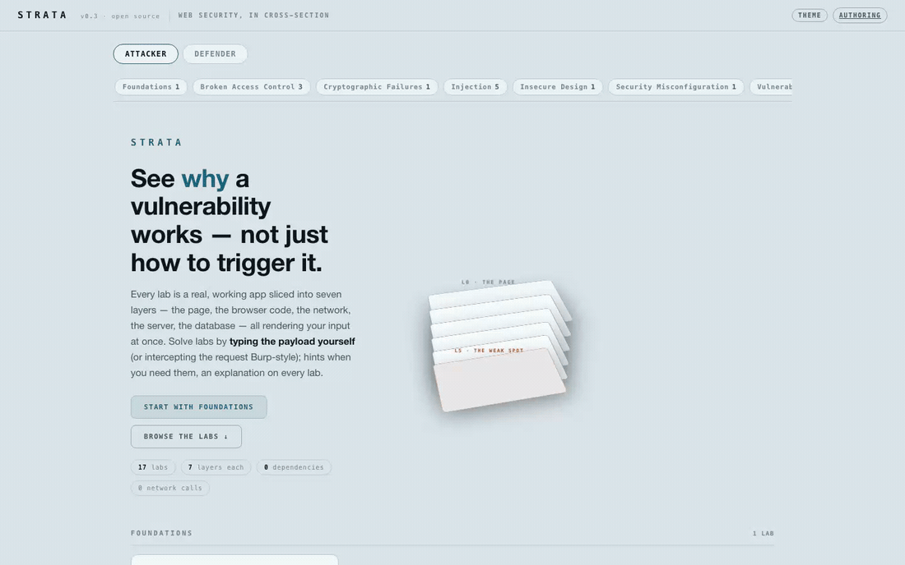
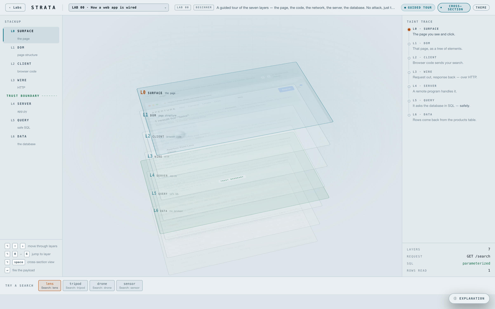
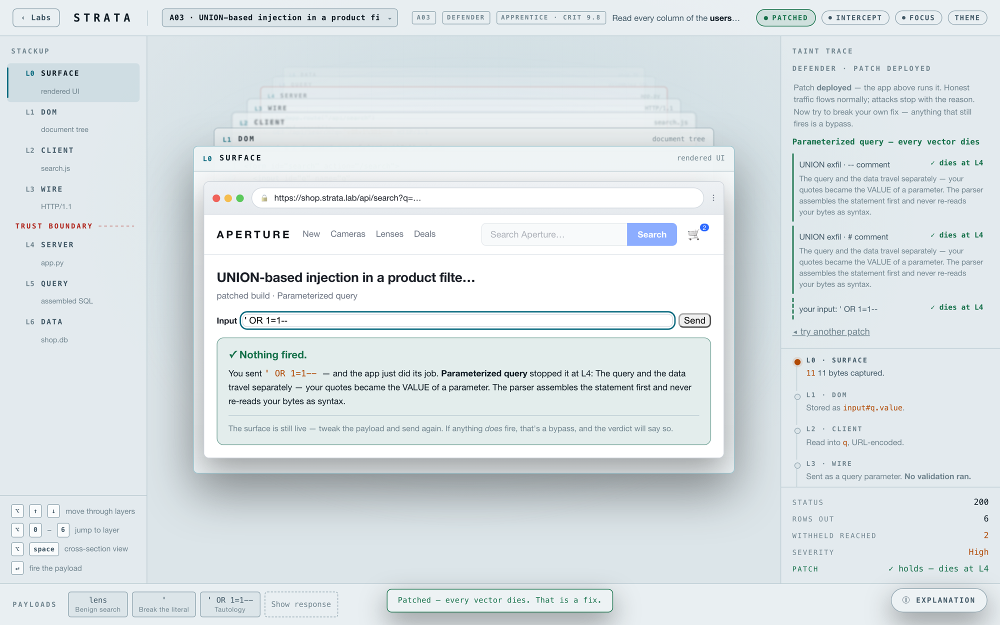
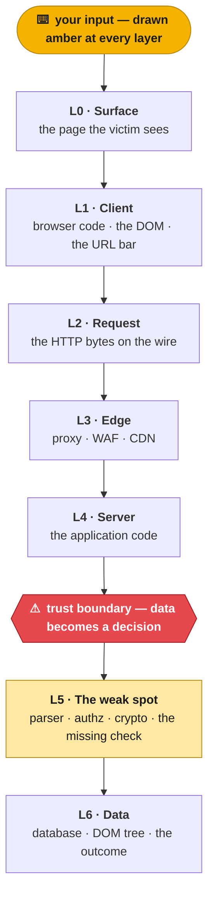
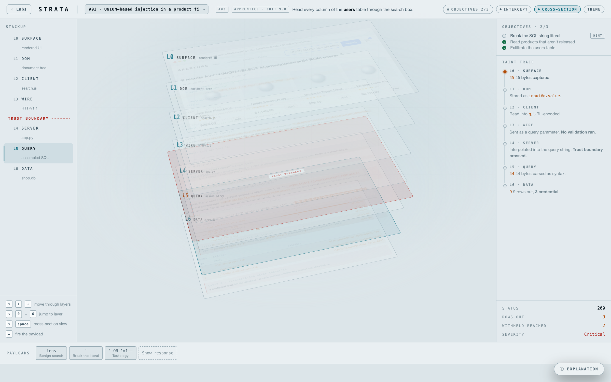
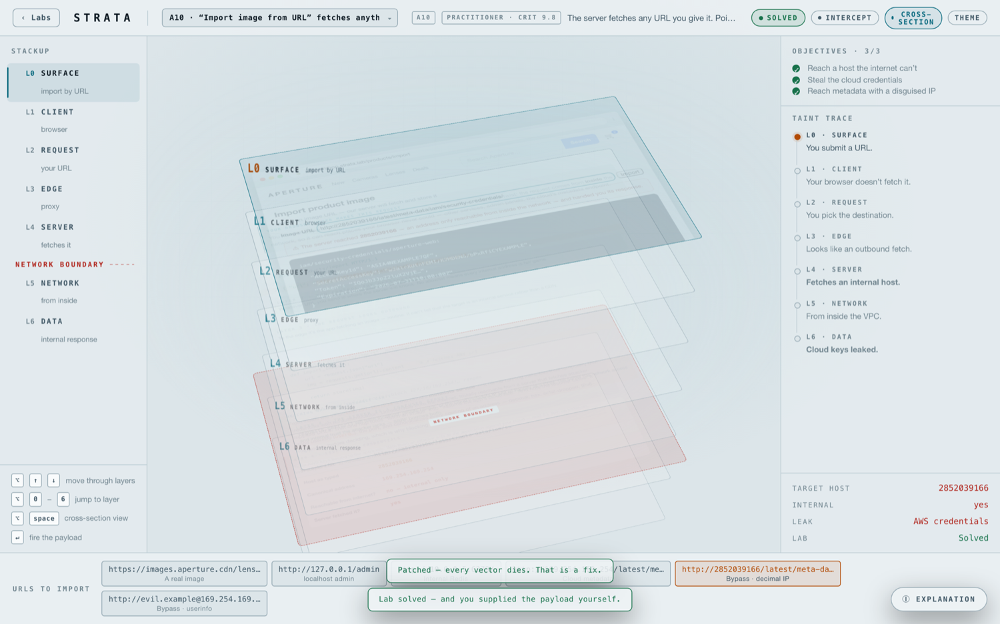
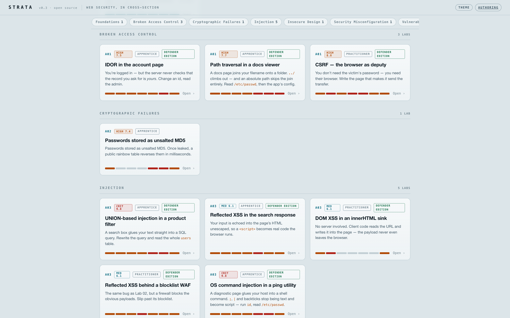

<div align="center">

# STRATA

### Web security, in cross-section.

**A multi-layered security lab where you learn *why* a vulnerability works — not just how to trigger it.**

STRATA renders a vulnerable web app as a **cross-section** — seven layers stacked in depth, all showing the same request at once. Every byte you type is drawn in **amber** at every layer, so you *watch* your own input travel the stack until the moment it stops being data and becomes syntax, markup, or a decision. Then you flip sides and put it back together.

<br>

[](LICENSE)


<br>

### [▶ &nbsp;Open the live demo](https://m0m0x01d.github.io/strata/strata.html)

<sub>runs entirely in your browser · nothing is sent anywhere</sub>

<br>

**[Quick start](#quick-start)** · **[What's different](#what-makes-strata-different)** · **[Who it's for](#who-its-for)** · **[Play](#two-ways-to-play)** · **[The labs](#the-lab-catalog)** · **[Make your own](#build-your-own-lab)** · **[Tooling](#command-line-tooling)**

<br>



<sub>*Type a payload, watch it cross the stack — from keystroke to leaked credentials.*</sub>

</div>

---

## Quick start

> [!TIP]
> There is nothing to install. Try the **[live demo](https://m0m0x01d.github.io/strata/strata.html)**, or **open `strata.html` in any modern browser** and you're in.

```sh
# Clone it locally
git clone https://github.com/m0m0x01d/strata.git
cd strata

# Option A — just open the file (no server needed)
open strata.html                # macOS   ·   xdg-open strata.html on Linux   ·   start strata.html on Windows
#   …or simply double-click strata.html in your file manager.

# Option B — serve the folder (enables the community shelf + the in-app Authoring link)
python3 -m http.server 8641     # then visit http://127.0.0.1:8641/strata.html
```

> [!NOTE]
> Prefer not to clone? On the repo page, open [`strata.html`](strata.html), click **Raw**, and save the page (`Ctrl/⌘+S`) — that single file *is* the whole app.

No build step, no `npm install`, no accounts, no backend. Progress persists in your browser's `localStorage` (`strata.progress.v1`) and never leaves your machine.

<div align="center"><br><br><sub>*The whole instrument in one glance — the Foundations tour, edge-on. Seven layers of a single request, from the page to the database. Every lab is this same machine with a different bug wired in.*</sub><br><br></div>

---

## What makes STRATA different

Most security trainers show you *a payload that works*. STRATA shows you **the machine that makes it work** — and then lets you break the machine, or fix it.

- **One request, seven layers, all at once.** The page, the client code, the wire, the edge, the server, the weak spot, and the data — every plane renders *the same input you typed*, live, on every keystroke.
- **The taint is the lesson.** Every byte that originated from you is **amber**, at every layer, without exception. Nothing else in the UI is warm. You watch amber stop being *data* and become *syntax* (SQL), *markup* (HTML), *source* (shell), or a *path operator* (`..`) — the exact instant a vulnerability is born.
- **Honest engines, simulated effects.** A real SQL lexer. A real XSS vector scanner that knows which handlers auto-fire. A genuine RFC-1321 MD5 against a wordlist. A real IP canonicalizer that collapses `2852039166` to `169.254.169.254`. Nothing executes — the `alert()` on the surface is a drawing the engine *proves* would fire.
- **You type the payload.** Objectives complete only when the engine agrees. Type it yourself, or intercept the request Burp-style and edit the raw bytes. A solve you earn from a hint is labeled as such.
- **Every lab flips to Defender.** Deploy a real patch and it is *actually applied* — benign traffic keeps flowing, attacks die at a layer on screen, and the tempting non-fixes fail with the reason.
- **Infinite labs.** A lab is a single data file. Hand a report or a prompt to an AI and get a new, playable lab back — same instrument, new bug.

---

## Who it's for

STRATA is one tool that fits a lot of desks. A lab is just a file, so every one of these is a real workflow, not a wish-list.

| You are… | You use STRATA to… |
|---|---|
| **A student / self-learner** | Understand a bug class from the mechanism up — see the quote reach the parser, not just memorize `' OR 1=1`. Start at **Foundations**, follow the objective ladder, reveal hints only when stuck. |
| **An instructor / bootcamp** | Assign labs with zero infrastructure — one HTML file, runs offline, progress saved locally on each student's machine. Author a lab that mirrors *this week's* topic in minutes. |
| **Prepping for a CTF or interview** | Drill the OWASP Top 10 and the classic bypasses (WAF blocklists, IP canonicalization, `..//` collapsing) against honest engines that reward *understanding* the grammar, not guessing strings. |
| **On a security / AppSec team** | Turn a real finding into a shared, playable lab so the whole team understands it — then flip to Defender to settle *which* fix actually holds before it ships. |
| **A developer** | See how *your own code* gets exploited (paste it; the lab uses your real function names on the server layer), then watch the one-line fix neutralize it. |
| **Running onboarding / security champions** | Give new engineers a hands-on tour of how a request crosses trust boundaries — and why "hide the error" or "add `LIMIT 1`" isn't a fix. |

### Four things you can ask an AI to build

Because a lab is data, the catalog is open-ended. Hand [`docs/AI-LAB-BRIEF.md`](docs/AI-LAB-BRIEF.md) to an AI (or point a coding agent at it) and say any of:

> 🧪 **"Make me a lab to learn XSS."** → a focused, free-typed reflected/DOM/WAF lab with an objective ladder.
>
> 📄 **"Build a lab from this report:** ⟨paste a writeup / CVE / HackerOne link⟩**."** → the reporter's reproduction steps become the objectives, layer by layer.
>
> 📈 **"I finished lab X — make a harder one to train on."** → same bug class, one axis raised: a defense to bypass, a tighter constraint, second-order, or a nastier context.
>
> 🛡️ **"We got this finding — make an attack *and* defense lab so the team gets it."** → a full lab plus a Defender edition where the wrong fixes your team proposed fail on screen.

The two newest community labs — [`ssti-jinja`](labs/ssti-jinja.lab.js) (SSTI → RCE) and [`blind-sqli`](labs/blind-sqli.lab.js) (boolean-oracle password extraction) — were built exactly this way.

---

## Two ways to play

### 🗡️ Attacker — the classic STRATA

Pick a lab and you get a real, working vulnerable app sliced into seven planes you can **fly through** (focus mode) or **see edge-on** (cross-section, <kbd>⌥</kbd><kbd>Space</kbd>). The input is yours: **type the payload**, or toggle **Intercept** to pause the lab's *virtual* request and edit the raw HTTP bytes — URL-encoding and all — before sending. Every layer re-derives from those bytes exactly as an origin would decode them.

Each lab carries **objectives** — the phases of the real attack (*"break the literal" → "read withheld rows" → "exfiltrate the table"*) — that complete only when the engine says so. Hints reveal rung by rung; the last rung shows the payload, but a solve earned that way is labeled, and the answer preset stays locked until you've solved it yourself.

### 🛡️ Defender — flip every lab

The **Defender** tab lists every lab that ships defense data. The same vulnerable build stays live, and you **deploy candidate patches** — parameterize the query, escape the reflection, check the owner, verify the signature, require a metadata token. The patch is *actually applied*:

- **Honest traffic flows normally.** A real fix is invisible to benign input — a search for `lens` still returns products under a parameterized query.
- **Attacks die at a layer, visibly.** Send `' OR 1=1--` at the patched build and the response explains itself: *"✓ Nothing fired. Parameterized query stopped it at L4."* The blocking plane turns cold, the trace narrates the kill, and the input stays live so you can keep probing.
- **Wrong fixes fail on screen.** The engine runs the full attack battery against your choice. Hide-the-errors, `LIMIT 1`, quote-wrapping, string blocklists for SSRF (watch `2852039166` sail past), `HttpOnly` for XSS, algorithm-pinning for an unsigned JWT — each non-fix is shown *failing*, with the reason. A patch counts only when **every vector dies**; if your own payload still burns through, the verdict reads **✗ bypassed**.

<div align="center"><br><br><sub>*Defender mode: the real fix deployed — every vector dies at L4, and benign search still works.*</sub><br></div>

---

## The seven-layer instrument

Every lab is the same instrument with a different bug wired into it. Your input enters at the top and falls through the stack; the **trust boundary** (dashed) is where a byte you control gets to make a decision it shouldn't.



<div align="center"><br><br><sub>*A UNION injection, mid-exploit — the taint trace (right) narrates every layer, ending in 9 rows out and 3 leaked credentials.*</sub><br></div>

**Every lab has a different taint signature — and the signature *is* the lesson.** DOM XSS tunnels through the client and skips the network entirely (the request/edge/server planes go dark — the fragment never leaves the browser). The WAF lab stops amber at the edge until you slip past its grammar. CSRF's amber never crosses the boundary at all — you attack the *victim's browser*, and the cookie rides along by itself.

<div align="center"><br><br><sub>*A different bug, a different signature: SSRF crosses a **network** boundary and leaks cloud keys — the decimal IP `2852039166` is `169.254.169.254` in disguise.*</sub><br></div>

---

## The lab catalog

**17 built-in labs** span Foundations and the full OWASP Top 10. Ten of them flip to Defender.

<div align="center"><br><br><sub>*The catalog — grouped by category, with a sticky track-nav for jumping around; each card shows its severity, difficulty, taint signature, and whether it flips to Defender.*</sub><br></div>

| # | Lab | Category | Difficulty | Obj. | Severity¹ | Defender | Intercept |
|:--|:--|:--|:--|:-:|:--|:-:|:--|
| LAB 00 | How a web app is wired | Foundations | Beginner | tour | — | — | — |
| A01 | IDOR in the account page | Broken Access Control | Apprentice | 2 | `HIGH 7.5` | ✅ | query |
| A01 | Path traversal in a docs viewer | Broken Access Control | Apprentice | 2 | `HIGH 7.7` | ✅ | query |
| A01 | CSRF — the browser as deputy | Broken Access Control | Practitioner | 3 | `HIGH 8.8` | ✅ | — *(that's the lesson)* |
| A02 | Passwords stored as unsalted MD5 | Cryptographic Failures | Apprentice | 2 | `HIGH 7.4` | — | offline |
| A03 | UNION-based SQL injection | Injection | Apprentice | 3 | `CRIT 9.8` | ✅ | query |
| A03 | Reflected XSS in the search response | Injection | Apprentice | 2 | `MED 6.1` | ✅ | query |
| A03 | DOM XSS in an innerHTML sink | Injection | Practitioner | 3 | `MED 6.1` | ✅ | fragment |
| A03 | Reflected XSS behind a blocklist WAF | Injection | Practitioner | 3 | `MED 6.1` | ✅ | query |
| A03 | OS command injection in a ping utility | Injection | Apprentice | 2 | `CRIT 9.8` | ✅ | query |
| A04 | Checkout trusts a price from the browser | Insecure Design | Apprentice | 2 | `HIGH 8.1` | — | JSON body |
| A05 | Config & backup files served to the world | Security Misconfiguration | Apprentice | 3 | `HIGH 7.5` | — | path |
| A06 | A 9-year-old markdown library | Vulnerable & Outdated Components | Practitioner | 2 | `HIGH 8.8` | — | form |
| A07 | Username enumeration + no rate limit | Authentication Failures | Practitioner | 3 | `CRIT 9.8` | — | login |
| A08 | A JWT the server never verifies | Software & Data Integrity | Practitioner | 2 | `CRIT 9.1` | ✅ | JWT header |
| A09 | An account takeover nobody sees | Logging & Monitoring Failures | Practitioner | 2 | `LOW 3.7` | — | offline replay |
| A10 | "Import image from URL" fetches anything | Server-Side Request Forgery | Practitioner | 3 | `CRIT 9.8` | ✅ | JSON body |

<sub>¹ Typical real-world CVSS 3.1 base score for the bug class — the number a report gets, shown next to the number of lines that fix it.</sub>

Plus a growing shelf of **community labs** in [`labs/`](labs/): `open-redirect` (the annotated reference), `xss-waf-plus`, `ssti-jinja` (SSTI → RCE), and `blind-sqli` (boolean-oracle extraction).

---

## Build your own lab

A lab is **data**: layers, presets, a pure `analyze(q)`, per-layer renderers, a taint signature, objectives with hint ladders, and an optional Defender edition — one contract, validated and smoke-run on load against a battery of hostile probes. If `STRATA.registerLab()` accepts your object, your lab is done: it appears in the catalog, runs in the seven-plane instrument, and works with Intercept and Defender.

- **[`docs/AI-LAB-BRIEF.md`](docs/AI-LAB-BRIEF.md)** — *the headline path.* Written to hand to an AI: the four request shapes, every file to deliver, the full contract, the house voice, and a verify-before-handover loop.
- **[`docs/AUTHORING.md`](docs/AUTHORING.md)** — the same contract for a human reading it end to end: the helper library, the style guide, and the pre-submit checklist.
- **[`templates/lab-template.js`](templates/lab-template.js)** — a commented scaffold to copy (includes a `defense` skeleton).
- **[`labs/xss-waf-plus.lab.js`](labs/xss-waf-plus.lab.js)** — a complete worked example with a Defender edition.

```sh
node scripts/strata.mjs new my-lab                 # scaffold labs/my-lab.lab.js
node scripts/strata.mjs validate labs/my-lab.lab.js # the REAL page validator, headless
# then open strata.html and drop the file on the catalog to play it
```

---

## Loading external labs

STRATA loads labs two ways, with two deliberately different trust models.

| | 📎 Drag & drop a local file | 🌐 Community shelf |
|---|---|---|
| **How** | Drop any `…lab.js` calling `STRATA.registerLab({...})` onto the catalog | Fetch a published `catalog.json`, click **Load** |
| **Validation** | Real validator + engine smoke-run | Same — inside the sandbox |
| **Trust** | **Local code with the page's full privileges.** Only load files you trust. | **SHA-256 verified** against the catalog entry, then run in a **sandboxed worker**: no DOM, no `localStorage`, no network, output sanitized on the way back |
| **Intercept** | All wire types, incl. custom | Standard wire types |

> [!IMPORTANT]
> The community shelf is the **only** network request STRATA ever makes, and only when you click Fetch. A mismatched hash is refused by design; a missing hash is refused. The hash proves *the file you fetched is the file the publisher catalogued* — nothing more. Publish your own catalog by dropping `labs/` + `catalog.json` on any static host (GitHub Pages works); refresh hashes with `node scripts/strata.mjs catalog`.

---

## Keyboard and controls

| Keys | Action |
|:--|:--|
| <kbd>⌥</kbd><kbd>↑</kbd> / <kbd>⌥</kbd><kbd>↓</kbd>  ·  or <kbd>j</kbd> / <kbd>k</kbd> | move through layers |
| <kbd>⌥</kbd><kbd>0</kbd>…<kbd>9</kbd> | jump to a layer |
| <kbd>⌥</kbd><kbd>Space</kbd> | cross-section view (see every layer at once) |
| <kbd>Enter</kbd> | fire the payload |
| <kbd>Esc</kbd> | close popup → close intercept → back to catalog |

Scrolling inside a layer scrolls its content; the wheel only changes layers when there's nothing left to scroll. Add `?perf` to the URL for a timing HUD. The lab picker (top right) keeps your current side; the home page always resets to Attacker.

---

## Command-line tooling

Everything here is optional — the app itself has **zero dependencies and zero build**. The CLI needs only Node.

```sh
node scripts/strata.mjs new <id>          # scaffold labs/<id>.lab.js from the template
node scripts/strata.mjs validate labs/…   # run the REAL page validator against lab files
node scripts/strata.mjs hash labs/…       # SHA-256 for a catalog entry
node scripts/strata.mjs catalog           # refresh labs/catalog.json hashes
node scripts/strata.mjs check             # syntax-check the engine
```

<details>
<summary><b>Testing and CI</b></summary>

<br>

Four zero-dependency test suites run the real engine headlessly; [`.github/workflows/ci.yml`](.github/workflows/ci.yml) runs all of them plus the validator and a catalog-freshness check on every push and PR.

```sh
node tests/engine.test.mjs      # validator + reveal/benign invariants, every lab
node tests/regression.test.mjs  # per-lab behavioral regression
node tests/sandbox.test.mjs     # the worker protocol in a VM (hijacks, no-DOM canaries)
node tests/labs.test.mjs        # disk labs validate + catalog hashes current
```

The engine test also guards the file structurally: it fails if any `</script>` appears before the final one — a payload string closing the page's own script tag is this repo's most dangerous typo class.

</details>

---

## Repository layout

```
strata.html                  the entire app + the 17 golden-reference labs (one file)
docs/
  AI-LAB-BRIEF.md            hand this to an AI to generate a new lab (the headline path)
  AUTHORING.md               the lab format, helper library, style guide, AI recipe
  img/                       screenshots used by this README
templates/lab-template.js    scaffold to copy (with a defense skeleton)
labs/                        community labs + catalog.json (SHA-256 pinned)
                             open-redirect.lab.js doubles as the annotated reference
scripts/strata.mjs           optional CLI — new · validate · hash · catalog · check
tests/                       engine · regression · sandbox · lab-file suites (zero deps)
.github/workflows/ci.yml     runs everything on push / PR
```

---

## Threat model, honestly

- **The app executes nothing.** Payloads are *analyzed*; effects are *simulated* once the engine proves they'd fire. `alert()` is a drawing.
- **A lab file you load by hand is local code** with full page privileges — validation checks shape, not safety. That's a feature (labs are trivial to write) with a responsibility attached: only load files you trust.
- **Shelf labs are hash-pinned and sandboxed**, and their output is sanitized — but a catalog is only as trustworthy as its publisher.
- **Nothing is sent anywhere,** because nothing is ever sent anywhere. Your progress lives in your browser.

---

## Roadmap

Early and evolving. **Shipped:** the cross-section engine, 17 labs, Attacker + Defender modes, virtual intercept, the lab format + validator + sandbox, community-catalog mechanics, the AI authoring brief, CLI, tests and CI.

**Next:** report-derived labs modeled on real public writeups, a published community catalog, sandboxed backends for server-side labs (free-typed exploits against a real origin), teacher/course mode, and progress sync.

---

## Contributing

New labs are the most valuable contribution — build one with [`docs/AI-LAB-BRIEF.md`](docs/AI-LAB-BRIEF.md), validate it (`node scripts/strata.mjs validate`), play it end to end, and open a PR. Bug reports and engine fixes are welcome too; the test suites make regressions easy to catch.

## License

[MIT](LICENSE) — © 2026 STRATA contributors.

<div align="center"><br><sub>Built to be read, not just run. Open <code>strata.html</code> and watch your payload cross the stack.</sub></div>
